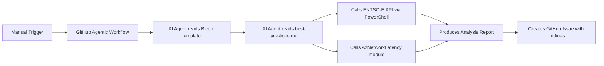

# Sustainability Bicep Analyzer — Using GitHub Agentic Workflows

[](https://github.github.com/gh-aw/)
[](https://docs.microsoft.com/powershell/)
[](https://transparency.entsoe.eu/)

## What is this?

This is a **demonstration repository** showing how to use [GitHub Agentic Workflows (gh-aw)](https://github.github.com/gh-aw/) to create an AI-powered Bicep template analyzer focused on **sustainability** and **best practices** for Azure infrastructure.

When triggered, an AI agent (GitHub Copilot) analyzes a Bicep template and produces a detailed report covering:

- 🌍 **Sustainability** — Checks if resources are deployed in regions powered by renewable energy (via ENTSO-E real-time data)
- 🔒 **Security** — Validates Zero Trust principles (HTTPS everywhere, TLS 1.2+)
- 💰 **Cost Optimization** — Detects over-provisioned SKUs and tiers
- ⚡ **Performance** — Verifies latency between dependent resources is acceptable
- 🔄 **Reliability** — Ensures redundancy levels are consistent across all components

> **⚠️ EU-Only Scope:** This tool is designed exclusively for European Union Azure datacenters, as our customers are limited to EU regions for data residency requirements.

---

## How it Works



1. You trigger the workflow manually from the **Actions** tab
2. The AI agent reads `bicep/main.bicep` and `best-practices.md`
3. It calls custom tools (MCP Scripts) that run PowerShell scripts to:
   - Query the **ENTSO-E Transparency Platform** for real-time energy generation data
   - Query **AzNetworkLatency** for inter-region latency measurements
4. The agent analyzes the Bicep template against the best-practice rules
5. A detailed report is created as a **GitHub Issue**

---

## Repository Structure

```
├── .github/
│   └── workflows/
│       └── sustainability-analyzer.md      # GitHub Agentic Workflow definition
├── bicep/
│   └── main.bicep                          # Sample Bicep template (NOT deployed, demo only)
├── scripts/
│   ├── Get-RegionEnergy.ps1                # Queries ENTSO-E API for energy mix
│   ├── Get-RegionLatency.ps1               # Queries inter-region latency
│   └── Test-BicepLocally.ps1               # Local test runner
├── data/
│   └── azure-region-eic-mapping.json       # EU Azure region → ENTSO-E EIC code mapping
├── best-practices.md                        # Editable rules the AI checks against
├── PLAN.md                                  # Project plan and architecture decisions
├── DECISIONS.md                             # Technical choices and rationale
├── .env.example                             # Environment variable template
├── .gitignore                               # Excludes .env files with secrets
└── README.md                                # This file
```

---

## Setup

### Prerequisites

1. **GitHub repository** with [GitHub Copilot](https://github.com/features/copilot) access
2. **ENTSO-E API token** — Register for free at [transparency.entsoe.eu](https://transparency.entsoe.eu/) and request an API token in your account settings
3. **GitHub CLI** with the `gh-aw` extension installed:
   ```bash
   gh extension install github/gh-aw
   ```

### Repository Secrets

Configure these secrets in your repository settings (**Settings → Secrets and variables → Actions**):

| Secret | Description |
|--------|-------------|
| `ENTSOE_TOKEN` | Your ENTSO-E Transparency Platform API security token |
| `COPILOT_GITHUB_TOKEN` | Required by the gh-aw engine (GitHub Copilot token) |

### Compile the Workflow

After cloning, compile the agentic workflow markdown into a GitHub Actions YAML file:

```bash
gh aw compile
```

This generates `.github/workflows/sustainability-analyzer.lock.yml` which is the actual GitHub Actions workflow file.

---

## Usage

### Trigger the Analysis

**Option 1: GitHub UI**
1. Go to the **Actions** tab
2. Select "Sustainability Analyzer"
3. Click **Run workflow**

**Option 2: CLI**
```bash
gh aw run sustainability-analyzer
```

### View Results

After the workflow completes, check the **Issues** tab for a new issue titled:
> "Sustainability & Best Practices Analysis Report"

### Customize Rules

Edit `best-practices.md` to add, modify, or remove rules. The AI agent reads this file on every run, so changes take effect immediately on the next trigger.

---

## Local Testing

You can test the PowerShell scripts locally without triggering the full workflow:

1. Copy `.env.example` to `.env` and add your ENTSO-E token:
   ```
   ENTSOE_TOKEN=your-actual-token-here
   ```

2. Run the local test script:
   ```powershell
   .\scripts\Test-BicepLocally.ps1
   ```

This runs the energy and latency checks against the regions used in the sample Bicep template.

---

## The Sample Bicep Template

The file `bicep/main.bicep` deploys a **deliberately flawed** EU architecture for demonstration:

- Azure Front Door (Premium) → App Service (West Europe) → SQL Database (Poland Central)
- Internal Load Balancer with HA Ports
- Storage Account for diagnostics

**Intentional issues the analyzer should find:**

| # | Issue | Rule |
|---|-------|------|
| 1 | Storage Account uses LRS while rest uses ZRS | RULE-001 |
| 2 | Front Door Premium when Standard suffices | RULE-002 |
| 3 | Load Balancer with unnecessary HA Ports | RULE-002 |
| 4 | App Service Plan P3v3 is oversized | RULE-003 |
| 5 | Front Door backend uses HTTP, not HTTPS | RULE-004 |
| 6 | SQL Database in Poland (high fossil fuel) | RULE-006 |
| 7 | App (westeurope) ↔ DB (polandcentral) latency | RULE-007 |

> **Note:** This template is never deployed. It exists purely as a target for static analysis.

---

## Data Sources

| Source | What it provides | Documentation |
|--------|-----------------|---------------|
| [ENTSO-E Transparency Platform](https://transparency.entsoe.eu/) | Real-time electricity generation mix per EU bidding zone | [API Docs](https://documenter.getpostman.com/view/7009892/2s93JtP3F6) |
| [AzNetworkLatency Module](https://github.com/autosysops/PowerShell_AzNetworkLatency) | Inter-region network latency measurements | [PSGallery](https://www.powershellgallery.com/packages/AzNetworkLatency/) |

---

## Contributing

1. **Add new rules:** Edit `best-practices.md` with a new `RULE-XXX` section
2. **Add new regions:** Update `data/azure-region-eic-mapping.json` with the region's EIC code
3. **Modify the Bicep template:** Add new resources or issues to `bicep/main.bicep`
4. **Improve scripts:** Enhance the PowerShell scripts in `scripts/`

---

## License

[MIT](LICENSE)